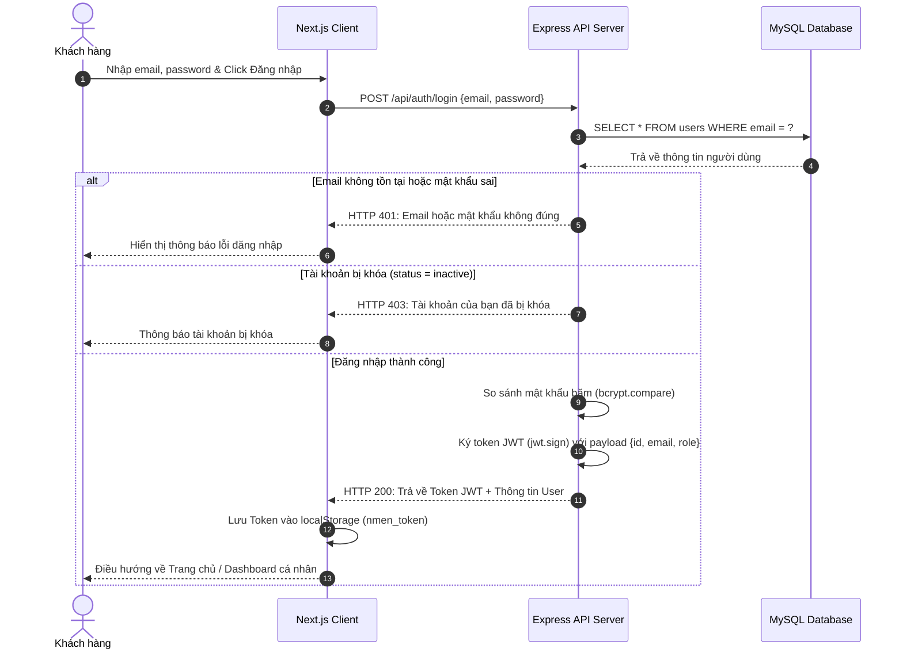
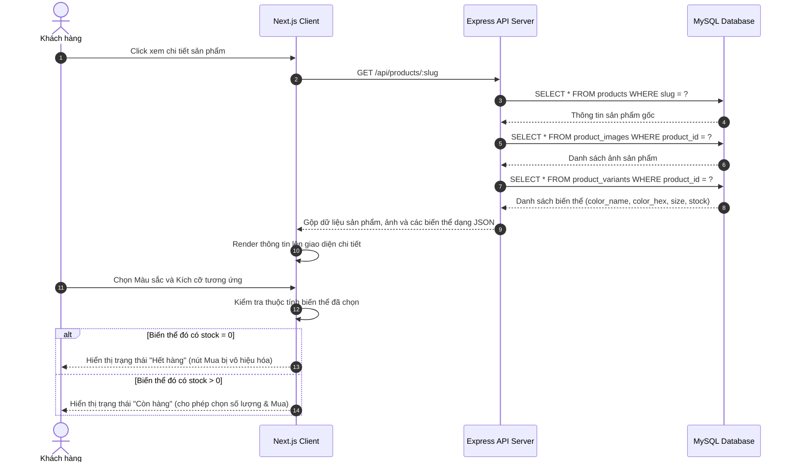
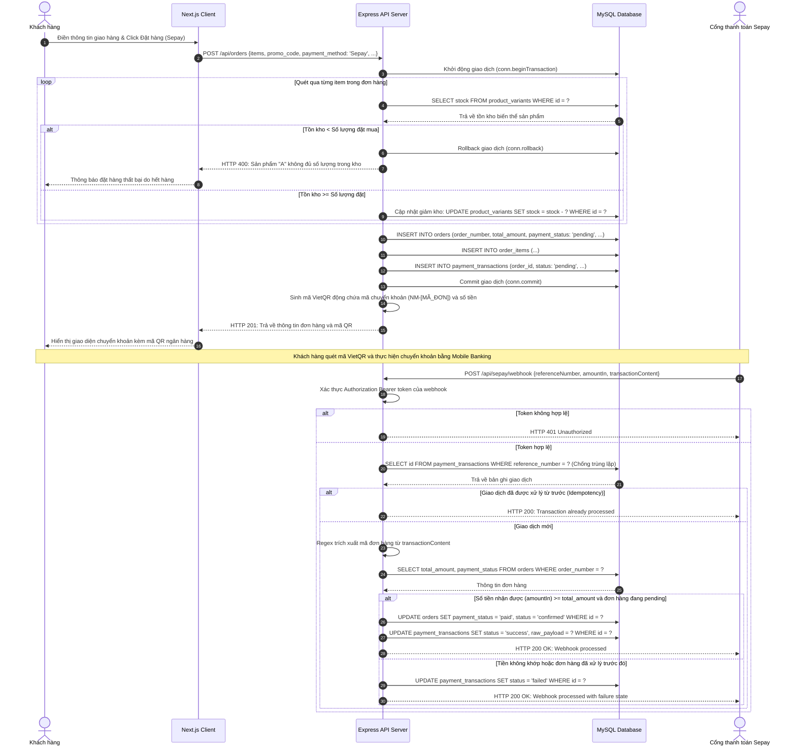
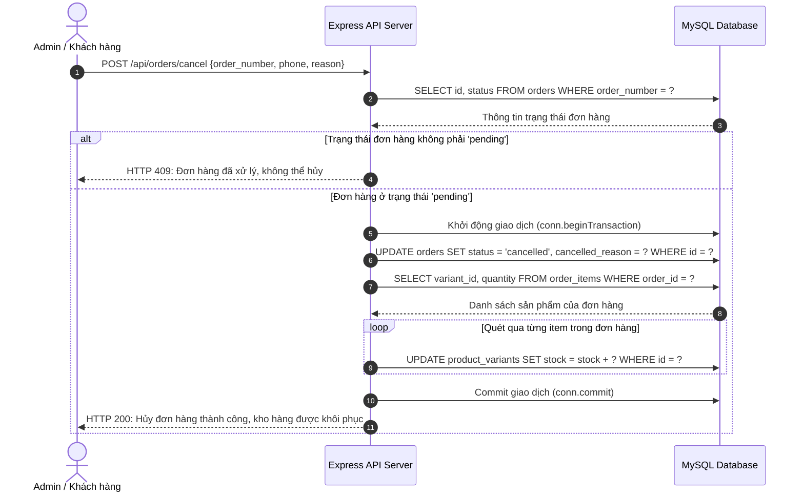
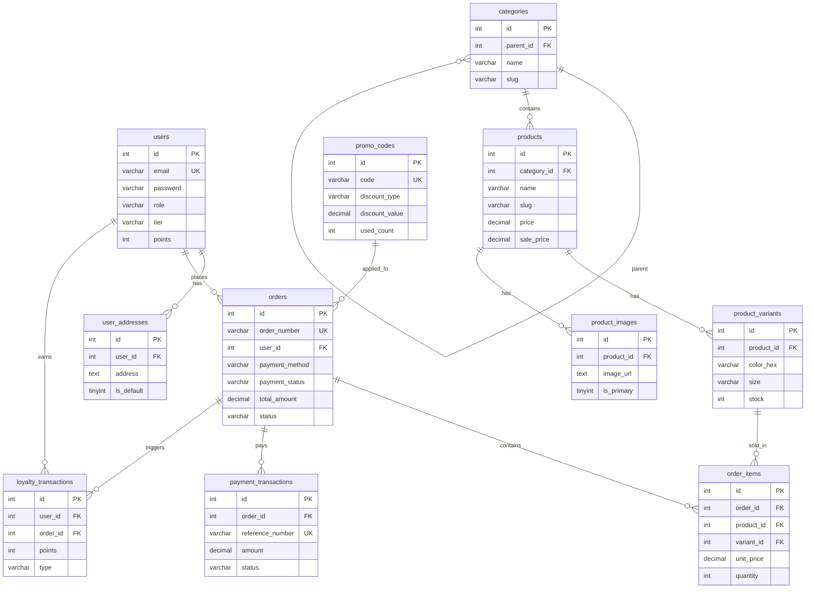

# BÁO CÁO THỰC TẬP TỐT NGHIỆP ĐỀ TÀI: XÂY DỰNG WEBSITE THƯƠNG MẠI ĐIỆN TỬ THỜI TRANG NAM NMEN FASHION

---

## 🏫 TRƯỜNG ĐẠI HỌC MỞ HÀ NỘI
### TRUNG TÂM ĐÀO TẠO E-LEARNING
***

<br/>

<div align="center">
  <h1>BÁO CÁO THỰC TẬP TỐT NGHIỆP CHUYÊN NGÀNH</h1>
  <h2>ĐỀ TÀI: XÂY DỰNG WEBSITE THƯƠNG MẠI ĐIỆN TỬ THỜI TRANG NAM NMEN FASHION</h2>
  <br/>
  <p><strong>Ngành đào tạo:</strong> Công nghệ thông tin</p>
  <p><strong>Mã học phần:</strong> [MÃ_HỌC_PHẦN_VÍ_DỤ_IT43]</p>
</div>

<br/><br/>

#### 👤 THÔNG TIN SINH VIÊN & ĐƠN VỊ THỰC TẬP:
* **Họ và tên sinh viên**: `[HỌ_TÊN_SINH_VIÊN]`
* **Mã sinh viên**: `[MÃ_SINH_VIÊN]`
* **Lớp**: `[LỚP_HỌC]`
* **Đơn vị thực tập**: `[ĐƠN_VỊ_THỰC_TẬP_VÍ_DỤ_CÔNG_TY_CỔ_PHẦN_PHẦN_MỀM_REVOTECH]`
* **Địa điểm thực tập**: `[ĐỊA_CHỈ_ĐƠN_VỊ_THỰC_TẬP]`
* **Giảng viên hướng dẫn**: `[TÊN_GIẢNG_VIÊN_HƯỚNG_DẪN]`

<div align="right">
  <p><strong>Hà Nội — Năm 2026</strong></p>
</div>

---

## ✍️ NHẬN XÉT CỦA CƠ QUAN THỰC TẬP
*(Đơn vị thực tập: `[ĐƠN_VỊ_THỰC_TẬP]`)*

1. **Về tinh thần, thái độ, ý thức tổ chức kỷ luật**:
..................................................................................................................................................................................
..................................................................................................................................................................................
2. **Về năng lực chuyên môn và công việc được giao**:
..................................................................................................................................................................................
..................................................................................................................................................................................
3. **Đánh giá chung và đề xuất**:
..................................................................................................................................................................................
..................................................................................................................................................................................

<table width="100%">
  <tr>
    <td width="50%" align="center">
      <p><strong>Người hướng dẫn trực tiếp</strong></p>
      <p><i>(Ký và ghi rõ họ tên)</i></p>
    </td>
    <td width="50%" align="center">
      <p><strong>Xác nhận của Đơn vị thực tập</strong></p>
      <p><i>(Ký tên và đóng dấu)</i></p>
    </td>
  </tr>
</table>

---

## 👩‍🏫 NHẬN XÉT CỦA GIẢNG VIÊN HƯỚNG DẪN
*(Giảng viên hướng dẫn: `[TÊN_GIẢNG_VIÊN_HƯỚNG_DẪN]`)*

1. **Tiến độ thực hiện đề tài**: ...................................................................................................................
2. **Ý thức, thái độ trong quá trình hướng dẫn**: .........................................................................................
3. **Khả năng kết hợp lý thuyết và thực tiễn**: ..............................................................................................
4. **Hình thức trình bày báo cáo**: ..............................................................................................................
5. **Đánh giá chung**: .................................................................................................................................
* **Điểm hoàn thành đề tài**: ................................. Bằng chữ: ........................................................................

<div align="right">
  <p><strong>Giảng viên hướng dẫn</strong></p>
  <p><i>(Ký và ghi rõ họ tên)</i></p>
</div>

---

## 📅 PHÂN CÔNG NHIỆM VỤ & TIẾN ĐỘ THỰC HIỆN

Dưới đây là bảng phân công nhiệm vụ và tiến độ xây dựng báo cáo chuyên đề và cài đặt hệ thống:

| STT | Công việc | Đối tượng thực hiện | Thời gian thực hiện | Trạng thái |
|:---:|---|:---:|:---:|:---:|
| 1 | Khảo sát quy trình thực tế & Phát biểu bài toán | Sinh viên | Tuần 1 | Hoàn thành |
| 2 | Phân tích hệ thống (Xây dựng sơ đồ Use Case, Đặc tả chức năng) | Sinh viên | Tuần 2 - 3 | Hoàn thành |
| 3 | Thiết kế cơ sở dữ liệu và sơ đồ thực thể liên kết (ERD) | Sinh viên | Tuần 4 | Hoàn thành |
| 4 | Cài đặt Backend API (Express.js, REST API, Webhook Sepay) | Sinh viên | Tuần 5 - 6 | Hoàn thành |
| 5 | Thiết kế giao diện Frontend (Next.js 16, Tailwind CSS v4) | Sinh viên | Tuần 7 - 8 | Hoàn thành |
| 6 | Kiểm thử hệ thống, xử lý tồn kho & bảo mật phân quyền | Sinh viên | Tuần 9 | Hoàn thành |
| 7 | Viết tài liệu báo cáo tốt nghiệp & Chuẩn bị slide bảo vệ | Sinh viên | Tuần 10 | Hoàn thành |

---

## 📖 DANH MỤC CHỮ VIẾT TẮT

| Ký hiệu | Viết tắt bằng tiếng Anh / Việt | Giải thích nghĩa |
|:---:|---|---|
| **CSDL** | Cơ sở dữ liệu | Tập hợp thông tin có cấu trúc được lưu trữ trên hệ quản trị DB. |
| **CNTT** | Công nghệ thông tin | Ngành kỹ thuật ứng dụng máy tính để xử lý và quản lý thông tin. |
| **REST API** | Representational State Transfer API | Giao diện lập trình ứng dụng dạng Stateless dựa trên các phương thức HTTP. |
| **JWT** | JSON Web Token | Token mã hóa thông tin xác thực không trạng thái (Stateless). |
| **COD** | Cash on Delivery | Phương thức thanh toán khi nhận hàng. |
| **ERD** | Entity-Relationship Diagram | Sơ đồ quan hệ giữa các thực thể trong cơ sở dữ liệu. |
| **FDD** | Functional Decomposition Diagram | Sơ đồ phân cấp chức năng của hệ thống. |
| **MVC** | Model - View - Controller | Mô hình kiến trúc phần mềm tách biệt logic dữ liệu, hiển thị và điều hướng. |
| **SPA** | Single Page Application | Ứng dụng web chạy trên một trang đơn duy nhất. |
| **SSR** | Server-Side Rendering | Cơ chế kết xuất giao diện HTML trực tiếp từ phía máy chủ. |
| **VietQR** | Vietnamese Quick Response | Tiêu chuẩn mã phản hồi nhanh quốc gia về thanh toán chuyển khoản ngân hàng. |

---

## 📝 LỜI MỞ ĐẦU

Trong bối cảnh nền kinh tế số phát triển vượt bậc như hiện nay, thương mại điện tử không còn là một lựa chọn bổ sung mà đã trở thành huyết mạch sống còn đối với mọi doanh nghiệp bán lẻ. Sự bùng nổ của mạng Internet và thiết bị di động thông minh đã định hình lại hoàn toàn hành vi mua sắm của khách hàng. Thay vì phải đến trực tiếp các cửa hàng vật lý, người tiêu dùng ngày nay ưu tiên sự nhanh chóng, tiện lợi qua các nền tảng số. 

Đối với thị trường thời trang nam, khách hàng ngày càng đòi hỏi trải nghiệm mua sắm có tính chuyên nghiệp, nhanh gọn, hiển thị rõ nét các đặc tính phân loại sản phẩm (kích cỡ, màu sắc) cùng hình thức thanh toán đa dạng, bảo mật cao. Tuy nhiên, nhiều hệ thống e-commerce bán hàng thời trang hiện nay vẫn đang gặp khó khăn trong việc đồng bộ hóa dữ liệu tồn kho của các biến thể sản phẩm, dẫn đến tình trạng "bán khống" (khách đặt mua nhưng trong kho đã hết kích cỡ đó). Bên cạnh đó, quy trình đối soát thanh toán chuyển khoản thủ công gây tốn thời gian cho bộ phận vận hành và trì hoãn thời gian xử lý đơn hàng.

Để giải quyết triệt để những bất cập trên, em đã lựa chọn đề tài khóa luận tốt nghiệp: **"Xây dựng Website Thương mại Điện tử Thời trang Nam NMen Fashion tích hợp Hệ thống Thanh toán Tự động và Quản lý Điểm thành viên"**. 

Dự án sử dụng bộ đôi công nghệ hiện đại là **Next.js 16 (App Router)** cho Frontend và **Node.js/Express** cho Backend kết hợp cơ sở dữ liệu **MySQL**. Hệ thống được trang bị cơ chế bảo mật xác thực Stateless dùng JWT, băm mật khẩu Bcrypt, tích hợp thanh toán tự động qua cổng **Sepay Webhook** và quản lý giỏ hàng, đặt hàng tối ưu hóa kho hàng đa phân loại thông qua Database Transaction nhằm ngăn chặn tranh chấp dữ liệu.

Em xin chân thành cảm ơn thầy cô giáo Khoa Công nghệ thông tin — Trường Đại học Mở Hà Nội cùng các anh chị kỹ sư tại đơn vị thực tập `[ĐƠN_VỊ_THỰC_TẬP]` đã luôn hướng dẫn tận tình, định hướng công nghệ và tạo điều kiện thực tế tốt nhất để em hoàn thiện đề tài này một cách trọn vẹn.

---

## CHƯƠNG 1. PHÁT BIỂU BÀI TOÁN

### 1.1. Mô tả hệ thống thực
Hệ thống cửa hàng thời trang nam hoạt động kinh doanh trực tiếp kết hợp trực tuyến. Quy trình nghiệp vụ bán hàng thực tế bao gồm các giai đoạn sau:
1. **Quản lý danh mục & sản phẩm**: Sản phẩm thời trang được phân loại theo danh mục (áo blazer, sơ mi, quần khaki, phụ kiện...). Mỗi sản phẩm có các thuộc tính biến thể khác nhau về kích cỡ (S, M, L, XL, 28, 30, 32...) và màu sắc (Đen, Trắng Kem, Nâu Mocha...). Cửa hàng cần theo dõi chính xác số lượng tồn kho của từng biến thể cụ thể để lập kế hoạch nhập hàng.
2. **Khách hàng duyệt sản phẩm & mua sắm**: Khách hàng lựa chọn sản phẩm, chọn size và màu sắc phù hợp, thêm vào giỏ hàng. Khi tiến hành đặt hàng, khách hàng điền thông tin cá nhân, địa chỉ nhận hàng và chọn phương thức thanh toán (COD hoặc Chuyển khoản ngân hàng).
3. **Thanh toán & đối soát đơn hàng**:
   * Đối với đơn COD: Nhân viên đóng gói giao hàng, shipper thu hộ tiền.
   * Đối với đơn Chuyển khoản: Khách hàng chụp màn hình giao dịch chuyển khoản gửi qua Zalo/Fanpage hoặc nhân viên kế toán phải liên tục đăng nhập tài khoản ngân hàng trực tuyến (Internet Banking) để kiểm tra số dư và xác nhận đơn hàng bằng tay.
4. **Chương trình thành viên (Loyalty)**: Cửa hàng duy trì hệ thống tích lũy điểm khi mua hàng để kích cầu. Khách hàng tích điểm đạt mốc sẽ được nâng hạng thành viên (Đồng, Bạc, Vàng, Kim Cương) và được hưởng các đặc quyền chiết khấu.

### 1.2. Mô tả hạn chế của hệ thống thực tế cũ
* **Quản lý tồn kho thủ công**: Việc ghi chép sổ sách hoặc file Excel đơn thuần không kiểm soát tốt tồn kho của từng biến thể màu sắc/kích cỡ. Xảy ra tình trạng đơn hàng được tạo thành công nhưng thực tế trong kho đã hết biến thể size đó, khiến nhân viên phải gọi điện xin lỗi và đổi mẫu cho khách hàng.
* **Quy trình thanh toán chậm trễ và thiếu an toàn**: Xác nhận chuyển khoản bằng cách chụp ảnh hóa đơn rất dễ bị làm giả (sử dụng các công cụ biên tập ảnh giả mạo bill chuyển khoản thành công). Việc kế toán kiểm tra thủ công giao dịch ngân hàng làm chậm tiến độ xử lý giao hàng từ 2 - 4 tiếng, gây trải nghiệm xấu cho người mua.
* **Thiếu đồng bộ thông tin Loyalty**: Điểm thành viên tích lũy trên giấy hoặc các hệ thống bán lẻ tại quầy độc lập, khiến khách hàng trực tuyến không thể tra cứu điểm hoặc áp dụng đặc quyền giảm giá khi mua hàng online.

### 1.3. Mục tiêu xây dựng hệ thống mới
Hệ thống **NMen Fashion** được thiết kế nhằm đạt được các mục tiêu đột phá sau:
1. **Tự động hóa quản lý kho biến thể sản phẩm**: Đồng bộ tức thời số lượng tồn kho của từng biến thể màu sắc/kích cỡ khi khách hàng đặt hàng hoặc hủy đơn.
2. **Tự động hóa thanh toán (Automated Payment Processing)**: Tích hợp cổng thanh toán ngân hàng tự động qua **Sepay Webhook**. Khi tiền vào tài khoản ngân hàng, hệ thống tự động xác nhận đơn hàng đã thanh toán trong vòng 5 giây mà không cần con người can thiệp.
3. **Tích hợp hệ thống Loyalty và Coupon đồng bộ**: Tự động tích lũy điểm thành viên theo giá trị đơn hàng, nâng hạng thành viên thời gian thực và quản lý mã giảm giá bảo mật cao.
4. **Trải nghiệm giao diện cao cấp**: Xây dựng giao diện mượt mà, phản hồi nhanh, đáp ứng tiêu chuẩn SEO hiện đại.

### 1.4. Yêu cầu hệ thống
#### 1.4.1. Yêu cầu chức năng
Hệ thống được thiết kế phân quyền rõ rệt thành hai phân hệ giao diện:

```
                  ┌────────────────────────────────────────┐
                  │          HỆ THỐNG NMEN FASHION         │
                  └───────────────────┬────────────────────┘
                                      │
             ┌────────────────────────┴────────────────────────┐
             ▼                                                 ▼
   [ PHÂN HỆ KHÁCH HÀNG ]                             [ PHÂN HỆ QUẢN TRỊ ]
   ├── Đăng ký, Đăng nhập, Profile                    ├── Thống kê doanh thu & đơn hàng
   ├── Duyệt sản phẩm theo danh mục                   ├── Quản lý danh mục & sản phẩm
   ├── Bộ lọc theo size, màu, giá                     ├── Quản lý biến thể & hình ảnh
   ├── Quản lý giỏ hàng & Đặt hàng                    ├── Duyệt trạng thái đơn hàng & Hoàn kho
   ├── Thanh toán tự động (Sepay QR)                  ├── Cấu hình mã giảm giá (Promo Code)
   ├── Tra cứu đơn hàng vãng lai                      ├── Quản lý tin tức & Static Pages
   └── Tích lũy điểm & Lịch sử Loyalty                └── Cấu hình hệ thống (Settings)
```

#### 1.4.2. Yêu cầu phi chức năng
* **Hiệu năng (Performance)**: Tốc độ tải trang nhanh, thời gian phản hồi API dưới 300ms. Kết xuất Server-side Rendering cho các trang sản phẩm để tối ưu SEO.
* **Tính an toàn và bảo mật (Security)**: Mật khẩu người dùng được băm một chiều. Token xác thực JWT không trạng thái phải được đính kèm an toàn trên tiêu đề HTTP Header. Ngăn chặn triệt để việc thay đổi giá đơn hàng từ client.
* **Tính tin cậy & Nhất quán (Consistency)**: Chống Race Condition trong thao tác trừ kho hàng. Bảo đảm khi đơn hàng lỗi hoặc bị hủy, kho và mã giảm giá được khôi phục nguyên trạng thái cũ thông qua Transaction.

---

## CHƯƠNG 2. PHÂN TÍCH HỆ THỐNG

### 2.1. Sơ đồ phân cấp chức năng (FDD)

```
                            [ NMen Fashion System ]
                                       │
        ┌──────────────┬───────────────┼──────────────┬──────────────┐
        ▼              ▼               ▼              ▼              ▼
    [Thành viên]   [Sản phẩm]      [Đơn hàng]    [Thanh toán]   [Hệ thống]
    ├── Đăng ký    ├── Xem chi tiết├── Tạo đơn    ├── VietQR     ├── Tin tức
    ├── Đăng nhập  ├── Lọc màu/size├── Hủy đơn    ├── Webhook    ├── Banner/Slide
    ├── Profile    ├── Tìm kiếm    ├── Tra cứu    ├── Đối soát   ├── Mã giảm giá
    └── Loyalty    └── Đánh giá    └── Đổi status └── Idempotency└── Cài đặt
```

### 2.2. Sơ đồ Use Case tổng quát

#### Phân hệ khách hàng:
```mermaid
usecaseDiagram
    actor "Khách hàng" as customer
    
    usecase "Đăng ký / Đăng nhập" as uc_auth
    usecase "Duyệt sản phẩm & Bộ lọc" as uc_browse
    usecase "Tìm kiếm sản phẩm" as uc_search
    usecase "Quản lý Giỏ hàng" as uc_cart
    usecase "Đặt hàng & Thanh toán QR" as uc_checkout
    usecase "Tra cứu đơn hàng vãng lai" as uc_lookup
    usecase "Xem lịch sử tích điểm" as uc_loyalty
    
    customer --> uc_auth
    customer --> uc_browse
    customer --> uc_search
    customer --> uc_cart
    customer --> uc_checkout
    customer --> uc_lookup
    customer --> uc_loyalty
```

#### Phân hệ quản trị (Admin):
```mermaid
usecaseDiagram
    actor "Admin" as admin
    
    usecase "Xem biểu đồ thống kê" as uc_dashboard
    usecase "Quản lý Sản phẩm & Biến thể" as uc_manage_products
    usecase "Quản lý Đơn hàng & Cập nhật trạng thái" as uc_manage_orders
    usecase "Quản lý Mã giảm giá" as uc_manage_promos
    usecase "Cấu hình Website" as uc_manage_settings
    usecase "Quản lý Người dùng & Hạng thành viên" as uc_manage_users
    
    admin --> uc_dashboard
    admin --> uc_manage_products
    admin --> uc_manage_orders
    admin --> uc_manage_promos
    admin --> uc_manage_settings
    admin --> uc_manage_users
```

### 2.3. Đặc tả chi tiết các Use Case cốt lõi

#### 2.3.1. Use Case: Đặt hàng & Thanh toán tự động (Sepay Webhook)
* **Tên ca sử dụng**: Đặt hàng và thanh toán tự động qua ngân hàng.
* **Tác nhân**: Khách hàng, Cổng thanh toán Sepay.
* **Mô tả**: Khách hàng đặt mua các sản phẩm từ giỏ hàng, chọn phương thức chuyển khoản. Hệ thống tạo mã QR động chứa mã giao dịch chuyển khoản. Sau khi khách hàng chuyển khoản thành công, hệ thống nhận tín hiệu webhook để tự cập nhật trạng thái đã thanh toán.
* **Luồng sự kiện chính**:
  1. Khách hàng truy cập trang thanh toán, nhập địa chỉ giao hàng và áp dụng mã giảm giá (nếu có).
  2. Khách hàng lựa chọn phương thức thanh toán chuyển khoản ngân hàng qua cổng Sepay.
  3. Hệ thống kiểm tra số lượng tồn kho của từng biến thể sản phẩm.
  4. Hệ thống trừ kho trực tiếp, tạo đơn hàng ở trạng thái `pending` và tạo mã QR động VietQR chứa thông tin chuyển khoản dạng: `Thanh toan don hang NM-[MÃ_ĐƠN]`.
  5. Khách hàng quét mã VietQR trên ứng dụng ngân hàng di động và thực hiện giao dịch chuyển khoản.
  6. Ngân hàng xử lý biến động số dư tài khoản của cửa hàng, thông báo cho cổng thanh toán Sepay.
  7. Sepay gửi Webhook thông tin giao dịch đến endpoint API của hệ thống.
  8. Hệ thống xác thực signature của Webhook, giải mã thông tin, đối chiếu mã đơn hàng và số tiền giao dịch.
  9. Hệ thống cập nhật trạng thái đơn hàng thành `confirmed`, trạng thái thanh toán thành `paid`, ghi nhật ký transaction thành công.
* **Ngoại lệ**:
  * Nếu một sản phẩm trong đơn đã bị khách hàng khác đặt mua trước làm hết hàng tồn kho: Hệ thống thông báo sản phẩm không đủ số lượng, khôi phục lại giỏ hàng và rollback transaction.
  * Nếu số tiền khách chuyển khoản nhỏ hơn tổng tiền đơn hàng: Hệ thống ghi nhận trạng thái transaction thành công là `failed`, giữ nguyên trạng thái đơn hàng để admin đối soát trực tiếp.
  * Nếu cuộc gọi webhook bị lặp lại nhiều lần do lỗi mạng: Hệ thống kiểm tra trùng lặp `referenceNumber` của giao dịch trong cơ sở dữ liệu để ngăn cập nhật lặp đơn hàng.

#### 2.3.2. Use Case: Tra cứu & Hủy đơn hàng vãng lai
* **Tên ca sử dụng**: Tra cứu và hủy đơn hàng dành cho khách vãng lai (không đăng nhập).
* **Tác nhân**: Khách hàng vãng lai (Guest).
* **Mô tả**: Cho phép người mua hàng không cần tạo tài khoản vẫn có thể kiểm tra trạng thái vận chuyển và tự hủy đơn hàng khi đơn hàng đó chưa được quản trị viên duyệt gửi đi.
* **Luồng sự kiện chính**:
  1. Khách chọn tính năng Tra cứu đơn hàng trên menu website.
  2. Khách nhập mã đơn hàng (ví dụ: `NM-84042`) và số điện thoại mua hàng tương ứng.
  3. Hệ thống truy vấn cơ sở dữ liệu và hiển thị chi tiết thông tin đơn hàng, danh sách sản phẩm, trạng thái thanh toán, trạng thái giao nhận và lịch sử cập nhật.
  4. Nếu trạng thái đơn hàng hiện tại là `pending` (Chờ xác nhận), hệ thống hiển thị nút "Hủy đơn hàng".
  5. Khách hàng nhấn "Hủy đơn hàng" và nhập lý do hủy đơn.
  6. Backend nhận yêu cầu, bắt đầu database transaction: cập nhật trạng thái đơn thành `cancelled`, cập nhật lý do hủy đơn, quét qua danh sách sản phẩm của đơn hàng để cộng trả lại số lượng tương ứng vào tồn kho biến thể sản phẩm (`product_variants.stock`).
  7. Hệ thống báo hủy đơn hàng thành công và cập nhật lại giao diện tra cứu.

---

### 2.4. Biểu đồ trình tự (Sequence Diagrams)

#### 2.4.1. Biểu đồ trình tự: Xác thực & Đăng nhập (Authentication)
Biểu đồ mô tả quy trình đăng nhập phía khách hàng, có kiểm tra trạng thái tài khoản đang hoạt động (`status = active`):



#### 2.4.2. Biểu đồ trình tự: Xem sản phẩm & Chọn biến thể
Mô tả quy trình tải thông tin chi tiết sản phẩm kết hợp danh sách ảnh, thuộc tính biến thể màu sắc và kích cỡ có lọc tồn kho:



#### 2.4.3. Biểu đồ trình tự: Đặt hàng & Thanh toán tự động qua Sepay Webhook
Mô tả toàn bộ tiến trình đặt hàng, sử dụng Database Transaction để khóa dữ liệu, kiểm tra tồn kho biến thể và quy trình nhận Webhook tự động cập nhật trạng thái thanh toán:



#### 2.4.4. Biểu đồ trình tự: Hủy đơn hàng & Hoàn trả kho tự động
Mô tả quy trình khách hàng hoặc admin thực hiện hủy một đơn hàng hợp lệ ở trạng thái chờ duyệt, hệ thống tự động cộng ngược số lượng sản phẩm trả lại kho:



---

## CHƯƠNG 3. THIẾT KẾ HỆ THỐNG

### 3.1. Thiết kế cơ sở dữ liệu vật lý

Dưới đây là thiết kế chi tiết 17 bảng dữ liệu vật lý trong hệ quản trị cơ sở dữ liệu MySQL của dự án NMen Fashion:

#### 3.1.1. Bảng `users` (Quản lý người dùng và hạng thành viên)
* **Khóa chính**: `id`

| STT | Tên cột | Kiểu dữ liệu | Ràng buộc | Mô tả |
|:---:|---|---|---|---|
| 1 | `id` | int(11) | PK, Auto Increment | Mã số người dùng, tự động tăng |
| 2 | `full_name` | varchar(100) | Not Null | Họ và tên người dùng |
| 3 | `email` | varchar(100) | Not Null, Unique | Email đăng nhập (Duy nhất) |
| 4 | `password` | varchar(255) | Not Null | Mật khẩu đã băm (Bcrypt) |
| 5 | `phone` | varchar(20) | Null | Số điện thoại |
| 6 | `role` | enum('admin', 'customer') | Not Null, Default 'customer' | Quyền truy cập hệ thống |
| 7 | `tier` | enum('Hạng Đồng', 'Hạng Bạc', 'Hạng Vàng', 'Hạng Đen') | Not Null, Default 'Hạng Đồng' | Phân hạng tích điểm Loyalty |
| 8 | `points` | int(11) | Not Null, Default 0 | Số điểm tích lũy hiện có |
| 9 | `avatar_url` | text | Null | Đường dẫn ảnh đại diện |
| 10 | `joined_at` | timestamp | Not Null, Default CURRENT_TIMESTAMP | Ngày tham gia hệ thống |
| 11 | `updated_at` | timestamp | Not Null, Default CURRENT_TIMESTAMP | Ngày cập nhật gần nhất |
| 12 | `status` | enum('active', 'inactive') | Default 'active' | Trạng thái tài khoản |

#### 3.1.2. Bảng `categories` (Quản lý danh mục sản phẩm)
* **Khóa chính**: `id`
* **Khóa ngoại**: `parent_id` tham chiếu đến `categories(id)`

| STT | Tên cột | Kiểu dữ liệu | Ràng buộc | Mô tả |
|:---:|---|---|---|---|
| 1 | `id` | int(11) | PK, Auto Increment | Mã danh mục |
| 2 | `parent_id` | int(11) | FK, Null | Mã danh mục cha (đệ quy) |
| 3 | `name` | varchar(100) | Not Null | Tên danh mục |
| 4 | `slug` | varchar(100) | Not Null, Unique | Đường dẫn URL thân thiện |
| 5 | `position` | int(11) | Not Null, Default 0 | Thứ tự hiển thị trên menu |
| 6 | `status` | enum('active', 'hidden') | Not Null, Default 'active' | Trạng thái hiển thị |
| 7 | `description` | text | Null | Mô tả danh mục |
| 8 | `created_at` | timestamp | Not Null, Default CURRENT_TIMESTAMP | Ngày tạo |

#### 3.1.3. Bảng `products` (Quản lý sản phẩm gốc)
* **Khóa chính**: `id`
* **Khóa ngoại**: `category_id` tham chiếu đến `categories(id)`

| STT | Tên cột | Kiểu dữ liệu | Ràng buộc | Mô tả |
|:---:|---|---|---|---|
| 1 | `id` | int(11) | PK, Auto Increment | Mã sản phẩm |
| 2 | `category_id` | int(11) | FK, Not Null | Thuộc danh mục nào |
| 3 | `name` | varchar(200) | Not Null | Tên sản phẩm |
| 4 | `slug` | varchar(200) | Not Null, Unique | Đường dẫn URL sản phẩm |
| 5 | `sku` | varchar(50) | Null, Unique | Mã quản lý kho gốc sản phẩm |
| 6 | `price` | decimal(12,0) | Not Null | Giá gốc (VND) |
| 7 | `sale_price` | decimal(12,0) | Null | Giá khuyến mãi (nếu có) |
| 8 | `description` | text | Null | Bài viết mô tả sản phẩm |
| 9 | `is_published` | tinyint(1) | Not Null, Default 1 | Trạng thái hiển thị bán |
| 10 | `deleted_at` | timestamp | Null | Thời gian xóa tạm (Soft delete) |
| 11 | `created_at` | timestamp | Not Null, Default CURRENT_TIMESTAMP | Ngày đăng |
| 12 | `updated_at` | timestamp | Not Null, Default CURRENT_TIMESTAMP | Ngày cập nhật |

#### 3.1.4. Bảng `product_variants` (Biến thể phân loại kho hàng)
* **Khóa chính**: `id`
* **Khóa ngoại**: `product_id` tham chiếu đến `products(id)` ON DELETE CASCADE

| STT | Tên cột | Kiểu dữ liệu | Ràng buộc | Mô tả |
|:---:|---|---|---|---|
| 1 | `id` | int(11) | PK, Auto Increment | Mã biến thể sản phẩm |
| 2 | `product_id` | int(11) | FK, Not Null | Mã sản phẩm gốc |
| 3 | `sku` | varchar(50) | Null, Unique | Mã SKU cụ thể của biến thể |
| 4 | `color_name` | varchar(50) | Not Null | Tên màu sắc (ví dụ: Nâu Mocha) |
| 5 | `color_hex` | varchar(20) | Not Null | Mã màu Hex (ví dụ: #8b6f5e) |
| 6 | `size` | varchar(20) | Not Null | Kích cỡ (ví dụ: M, XL, 32) |
| 7 | `stock` | int(11) | Not Null, Default 0 | Số lượng tồn kho thực tế |

#### 3.1.5. Bảng `product_images` (Quản lý đa thư viện ảnh)
* **Khóa chính**: `id`
* **Khóa ngoại**: `product_id` tham chiếu đến `products(id)` ON DELETE CASCADE

| STT | Tên cột | Kiểu dữ liệu | Ràng buộc | Mô tả |
|:---:|---|---|---|---|
| 1 | `id` | int(11) | PK, Auto Increment | Mã ảnh |
| 2 | `product_id` | int(11) | FK, Not Null | Thuộc sản phẩm nào |
| 3 | `image_url` | text | Not Null | Đường dẫn lưu trữ tệp ảnh |
| 4 | `is_primary` | tinyint(1) | Not Null, Default 0 | Ảnh đại diện chính (1: Có) |
| 5 | `display_order` | int(11) | Not Null, Default 0 | Thứ tự hiển thị slide ảnh |

#### 3.1.6. Bảng `orders` (Quản lý thông tin đơn hàng)
* **Khóa chính**: `id`
* **Khóa ngoại**: `user_id` tham chiếu đến `users(id)` ON DELETE SET NULL
* **Khóa ngoại**: `shipping_province_id` tham chiếu đến `provinces(id)`
* **Khóa ngoại**: `shipping_commune_id` tham chiếu đến `communes(id)`

| STT | Tên cột | Kiểu dữ liệu | Ràng buộc | Mô tả |
|:---:|---|---|---|---|
| 1 | `id` | int(11) | PK, Auto Increment | Mã đơn hàng nội bộ |
| 2 | `order_number` | varchar(20) | Not Null, Unique | Mã đơn hiển thị (ví dụ: NM-45318) |
| 3 | `user_id` | int(11) | FK, Null | Mã khách hàng (nếu đã đăng nhập) |
| 4 | `customer_name` | varchar(100) | Not Null | Tên người nhận hàng |
| 5 | `email` | varchar(100) | Not Null | Email người đặt hàng |
| 6 | `phone` | varchar(20) | Not Null | Số điện thoại người nhận |
| 7 | `shipping_address` | text | Not Null | Số nhà, tên đường giao hàng |
| 8 | `shipping_commune` | varchar(100) | Null | Tên Phường/Xã giao hàng |
| 9 | `shipping_province` | varchar(100) | Not Null | Tên Tỉnh/Thành phố giao hàng |
| 10 | `shipping_province_id` | int(11) | FK, Null | Mã Tỉnh/Thành phố liên kết |
| 11 | `shipping_commune_id` | int(11) | FK, Null | Mã Phường/Xã liên kết |
| 12 | `payment_method` | enum('COD', 'Sepay') | Not Null, Default 'COD' | Phương thức thanh toán |
| 13 | `payment_status` | enum('pending', 'paid', 'failed', 'refunded') | Default 'pending' | Trạng thái thanh toán |
| 14 | `payment_ref` | varchar(100) | Null | Mã tham chiếu ngân hàng gửi về |
| 15 | `promo_code` | varchar(50) | Null | Mã giảm giá áp dụng |
| 16 | `discount_amount` | decimal(12,0) | Default 0 | Số tiền giảm giá |
| 17 | `subtotal` | decimal(12,0) | Not Null | Tổng tiền sản phẩm trước giảm |
| 18 | `shipping_fee` | decimal(12,0) | Default 0 | Phí vận chuyển giao hàng |
| 19 | `total_amount` | decimal(12,0) | Not Null | Thực thu (Tổng tiền cuối cùng) |
| 20 | `note` | text | Null | Ghi chú từ khách hàng |
| 21 | `cancelled_reason` | text | Null | Lý do hủy đơn hàng |
| 22 | `status` | enum('pending', 'confirmed', 'processing', 'shipping', 'delivered', 'cancelled', 'returned') | Default 'pending' | Trạng thái vòng đời đơn hàng |
| 23 | `points_earned` | int(11) | Default 0 | Số điểm tích lũy được từ đơn này |
| 24 | `points_used` | int(11) | Default 0 | Số điểm tiêu dùng để giảm trừ |
| 25 | `created_at` | timestamp | Default CURRENT_TIMESTAMP | Ngày đặt hàng |
| 26 | `updated_at` | timestamp | Default CURRENT_TIMESTAMP | Ngày cập nhật cuối cùng |

#### 3.1.7. Bảng `order_items` (Quản lý chi tiết sản phẩm đơn hàng)
* **Khóa chính**: `id`
* **Khóa ngoại**: `order_id` tham chiếu đến `orders(id)` ON DELETE CASCADE
* **Khóa ngoại**: `product_id` tham chiếu đến `products(id)` ON DELETE SET NULL
* **Khóa ngoại**: `variant_id` tham chiếu đến `product_variants(id)` ON DELETE SET NULL

| STT | Tên cột | Kiểu dữ liệu | Ràng buộc | Mô tả |
|:---:|---|---|---|---|
| 1 | `id` | int(11) | PK, Auto Increment | Mã bản ghi chi tiết |
| 2 | `order_id` | int(11) | FK, Not Null | Mã đơn hàng gốc |
| 3 | `product_id` | int(11) | FK, Null | Mã sản phẩm |
| 4 | `variant_id` | int(11) | FK, Null | Mã biến thể cụ thể đã mua |
| 5 | `product_name` | varchar(200) | Not Null | Tên sản phẩm tại thời điểm mua |
| 6 | `color_name` | varchar(50) | Null | Tên màu đã chọn |
| 7 | `color_hex` | varchar(20) | Null | Mã màu hex đã chọn |
| 8 | `size` | varchar(20) | Null | Kích cỡ đã chọn |
| 9 | `image_url` | varchar(500) | Null | Link ảnh sản phẩm tại thời điểm mua |
| 10 | `original_price` | decimal(12,0) | Not Null | Giá gốc sản phẩm |
| 11 | `unit_price` | decimal(12,0) | Not Null | Giá thực tế khách mua (đã giảm) |
| 12 | `quantity` | int(11) | Not Null | Số lượng mua của sản phẩm đó |
| 13 | `line_total` | decimal(12,0) | Generated (unit_price * quantity) | Tổng tiền dòng sản phẩm |

#### 3.1.8. Bảng `payment_transactions` (Quản lý lịch sử giao dịch thanh toán ngân hàng)
* **Khóa chính**: `id`
* **Khóa ngoại**: `order_id` tham chiếu đến `orders(id)` ON DELETE SET NULL

| STT | Tên cột | Kiểu dữ liệu | Ràng buộc | Mô tả |
|:---:|---|---|---|---|
| 1 | `id` | int(11) | PK, Auto Increment | Mã giao dịch hệ thống |
| 2 | `order_id` | int(11) | FK, Null | Liên kết với đơn hàng nào |
| 3 | `gateway` | varchar(50) | Default 'Sepay' | Cổng giao dịch kết nối |
| 4 | `reference_number` | varchar(100) | Not Null, Unique | Mã tham chiếu giao dịch ngân hàng |
| 5 | `amount` | decimal(12,0) | Not Null | Số tiền chuyển khoản biến động |
| 6 | `transaction_content` | text | Not Null | Nội dung chuyển khoản ngân hàng |
| 7 | `raw_payload` | longtext (JSON) | Null | Toàn bộ dữ liệu thô cổng gửi về |
| 8 | `status` | enum('pending', 'success', 'failed') | Default 'pending' | Trạng thái giao dịch đối soát |
| 9 | `created_at` | timestamp | Default CURRENT_TIMESTAMP | Thời gian ghi nhận giao dịch |

#### 3.1.9. Bảng `loyalty_transactions` (Lịch sử biến động điểm thành viên)
* **Khóa chính**: `id`
* **Khóa ngoại**: `user_id` tham chiếu đến `users(id)` ON DELETE CASCADE
* **Khóa ngoại**: `order_id` tham chiếu đến `orders(id)` ON DELETE SET NULL

| STT | Tên cột | Kiểu dữ liệu | Ràng buộc | Mô tả |
|:---:|---|---|---|---|
| 1 | `id` | int(11) | PK, Auto Increment | Mã giao dịch điểm |
| 2 | `user_id` | int(11) | FK, Not Null | Mã khách hàng nhận điểm |
| 3 | `order_id` | int(11) | FK, Null | Phát sinh từ đơn hàng nào |
| 4 | `type` | enum('earn', 'redeem', 'adjust') | Not Null | Kiểu biến động (Cộng/Trừ/Điều chỉnh) |
| 5 | `points` | int(11) | Not Null | Số lượng điểm thay đổi (+ hoặc -) |
| 6 | `note` | varchar(255) | Null | Ghi chú lý do biến động điểm |
| 7 | `created_at` | timestamp | Default CURRENT_TIMESTAMP | Thời gian tích điểm |

#### 3.1.10. Bảng `promo_codes` (Quản lý danh sách mã giảm giá)
* **Khóa chính**: `id`

| STT | Tên cột | Kiểu dữ liệu | Ràng buộc | Mô tả |
|:---:|---|---|---|---|
| 1 | `id` | int(11) | PK, Auto Increment | Mã số coupon |
| 2 | `code` | varchar(50) | Not Null, Unique | Tên mã giảm giá (ví dụ: WELCOME10) |
| 3 | `discount_type` | enum('percent', 'fixed') | Not Null, Default 'percent' | Loại giảm giá (Phần trăm hoặc số tiền cố định) |
| 4 | `discount_value` | decimal(10,2) | Not Null | Giá trị giảm trừ cụ thể |
| 5 | `min_order` | decimal(12,0) | Default 0 | Giá trị đơn tối thiểu để áp dụng |
| 6 | `max_uses` | int(11) | Null | Tổng số lần tối đa được sử dụng |
| 7 | `used_count` | int(11) | Not Null, Default 0 | Số lần thực tế đã sử dụng |
| 8 | `expires_at` | timestamp | Null | Ngày giờ hết hạn sử dụng mã |
| 9 | `is_active` | tinyint(1) | Default 1 | Trạng thái kích hoạt (1: Hoạt động) |
| 10 | `created_at` | timestamp | Default CURRENT_TIMESTAMP | Ngày tạo mã |

#### 3.1.11. Bảng `user_addresses` (Quản lý sổ địa chỉ của khách hàng)
* **Khóa chính**: `id`
* **Khóa ngoại**: `user_id` tham chiếu đến `users(id)` ON DELETE CASCADE
* **Khóa ngoại**: `province_id` tham chiếu đến `provinces(id)` ON DELETE SET NULL
* **Khóa ngoại**: `commune_id` tham chiếu đến `communes(id)` ON DELETE SET NULL

| STT | Tên cột | Kiểu dữ liệu | Ràng buộc | Mô tả |
|:---:|---|---|---|---|
| 1 | `id` | int(11) | PK, Auto Increment | Mã địa chỉ |
| 2 | `user_id` | int(11) | FK, Not Null | Liên kết mã khách hàng |
| 3 | `label` | varchar(50) | Default 'Nhà' | Nhãn địa chỉ (ví dụ: Nhà, Cơ quan) |
| 4 | `recipient` | varchar(100) | Not Null | Tên người nhận tại địa chỉ này |
| 5 | `phone` | varchar(20) | Null | Số điện thoại người nhận |
| 6 | `address` | text | Not Null | Địa chỉ số nhà và tên đường |
| 7 | `province_id` | int(11) | FK, Null | Mã tỉnh thành liên kết |
| 8 | `commune_id` | int(11) | FK, Null | Mã phường xã liên kết |
| 9 | `is_default` | tinyint(1) | Not Null, Default 0 | Đánh dấu địa chỉ mặc định (1: Có) |
| 10 | `created_at` | timestamp | Default CURRENT_TIMESTAMP | Ngày tạo |

#### 3.1.12. Bảng `provinces` (Danh sách tỉnh thành toàn quốc)
* **Khóa chính**: `id`

| STT | Tên cột | Kiểu dữ liệu | Ràng buộc | Mô tả |
|:---:|---|---|---|---|
| 1 | `id` | int(11) | PK, Auto Increment | Mã tỉnh thành |
| 2 | `code` | varchar(20) | Not Null, Unique | Mã code tỉnh |
| 3 | `name` | varchar(100) | Not Null | Tên tỉnh/thành phố (ví dụ: Hà Nội) |
| 4 | `level` | varchar(50) | Null | Cấp phân loại |

#### 3.1.13. Bảng `communes` (Danh sách quận huyện/phường xã)
* **Khóa chính**: `id`
* **Khóa ngoại**: `province_id` tham chiếu đến `provinces(id)` ON DELETE CASCADE

| STT | Tên cột | Kiểu dữ liệu | Ràng buộc | Mô tả |
|:---:|---|---|---|---|
| 1 | `id` | int(11) | PK, Auto Increment | Mã phường xã/quận huyện |
| 2 | `code` | varchar(20) | Not Null, Unique | Mã code phường xã |
| 3 | `name` | varchar(100) | Not Null | Tên phường xã/quận huyện |
| 4 | `level` | varchar(50) | Null | Cấp phân loại |
| 5 | `province_id` | int(11) | FK, Not Null | Liên kết thuộc tỉnh thành nào |

#### 3.1.14. Bảng `wishlists` (Danh sách sản phẩm yêu thích của khách)
* **Khóa chính**: `id`
* **Khóa ngoại**: `user_id` tham chiếu đến `users(id)` ON DELETE CASCADE
* **Khóa ngoại**: `product_id` tham chiếu đến `products(id)` ON DELETE CASCADE

| STT | Tên cột | Kiểu dữ liệu | Ràng buộc | Mô tả |
|:---:|---|---|---|---|
| 1 | `id` | int(11) | PK, Auto Increment | Mã bản ghi |
| 2 | `user_id` | int(11) | FK, Not Null | Mã khách hàng yêu thích |
| 3 | `product_id` | int(11) | FK, Not Null | Mã sản phẩm yêu thích |
| 4 | `added_at` | timestamp | Default CURRENT_TIMESTAMP | Thời điểm thêm vào danh sách |

#### 3.1.15. Bảng `news` (Quản lý bài viết tin tức)
* **Khóa chính**: `id`

| STT | Tên cột | Kiểu dữ liệu | Ràng buộc | Mô tả |
|:---:|---|---|---|---|
| 1 | `id` | int(11) | PK, Auto Increment | Mã bài viết |
| 2 | `title` | varchar(255) | Not Null | Tiêu đề bài viết tin tức |
| 3 | `slug` | varchar(255) | Not Null, Unique | Đường dẫn thân thiện bài viết |
| 4 | `author` | varchar(100) | Null | Tác giả bài viết |
| 5 | `image` | varchar(255) | Null | Đường dẫn ảnh bìa bài viết |
| 6 | `status` | enum('draft', 'published') | Default 'draft' | Trạng thái xuất bản |
| 7 | `short_description` | text | Null | Mô tả ngắn bài viết hiển thị list |
| 8 | `description` | text | Null | Nội dung chi tiết định dạng HTML |
| 9 | `created_at` | timestamp | Default CURRENT_TIMESTAMP | Ngày tạo bài |

#### 3.1.16. Bảng `pages` (Quản lý các trang tĩnh như Chính sách, Giới thiệu)
* **Khóa chính**: `id`

| STT | Tên cột | Kiểu dữ liệu | Ràng buộc | Mô tả |
|:---:|---|---|---|---|
| 1 | `id` | int(11) | PK, Auto Increment | Mã số trang tĩnh |
| 2 | `title` | varchar(255) | Not Null | Tiêu đề trang (ví dụ: Chính sách bảo mật) |
| 3 | `slug` | varchar(255) | Not Null, Unique | Đường dẫn URL trang tĩnh |
| 4 | `content` | text | Null | Nội dung bài viết định dạng HTML |
| 5 | `is_published` | tinyint(1) | Default 1 | Trạng thái hiển thị |
| 6 | `created_at` | timestamp | Default CURRENT_TIMESTAMP | Ngày tạo trang |
| 7 | `updated_at` | timestamp | Default CURRENT_TIMESTAMP | Ngày cập nhật |

#### 3.1.17. Bảng `settings` (Cấu hình toàn hệ thống)
* **Khóa chính**: `setting_key`

| STT | Tên cột | Kiểu dữ liệu | Ràng buộc | Mô tả |
|:---:|---|---|---|---|
| 1 | `setting_key` | varchar(100) | PK, Not Null | Khóa cấu hình (ví dụ: site_name) |
| 2 | `setting_value` | text | Null | Giá trị tương ứng |

---

### 3.2. Biểu đồ lớp lĩnh vực (Domain Class Diagram)
Biểu đồ các lớp thực thể dữ liệu thực tế được kết nối và quản lý trong hệ thống backend Node.js:

```mermaid
classDiagram
    class User {
        +int id
        +string full_name
        +string email
        +string password
        +string role
        +string tier
        +int points
        +login()
        +register()
        +updateProfile()
    }
    
    class Category {
        +int id
        +int parent_id
        +string name
        +string slug
        +int position
    }
    
    class Product {
        +int id
        +int category_id
        +string name
        +string slug
        +decimal price
        +decimal sale_price
        +string sku
        +getDetails()
    }
    
    class ProductVariant {
        +int id
        +int product_id
        +string color_name
        +string color_hex
        +string size
        +int stock
        +updateStock()
    }
    
    class ProductImage {
        +int id
        +int product_id
        +string image_url
        +bool is_primary
    }
    
    class Order {
        +int id
        +string order_number
        +int user_id
        +string customer_name
        +string phone
        +string shipping_address
        +string payment_method
        +string payment_status
        +decimal total_amount
        +string status
        +createOrder()
        +updateStatus()
        +cancelOrder()
    }
    
    class OrderItem {
        +int id
        +int order_id
        +int product_id
        +int variant_id
        +string product_name
        +decimal unit_price
        +int quantity
        +decimal line_total
    }
    
    class PaymentTransaction {
        +int id
        +int order_id
        +string reference_number
        +decimal amount
        +string status
        +recordTransaction()
    }
    
    class PromoCode {
        +int id
        +string code
        +string discount_type
        +decimal discount_value
        +decimal min_order
        +int used_count
        +validate()
    }

    User "1" --o{ Order : "đặt"
    Category "1" --o{ Product : "chứa"
    Product "1" --o{ ProductVariant : "có"
    Product "1" --o{ ProductImage : "có"
    Order "1" --o{ OrderItem : "gồm"
    ProductVariant "1" --o{ OrderItem : "bán"
    Order "1" --o{ PaymentTransaction : "thanh_toán"
    PromoCode "0..1" --o{ Order : "áp_dụng"
```

---

### 3.3. Sơ đồ quan hệ thực tế trong Database (Database Diagram)



---

## CHƯƠNG 4. CÀI ĐẶT HỆ THỐNG

### 4.1. Xác định công nghệ

Kiến trúc hệ thống thời trang NMen Fashion được thiết kế theo mô hình phát triển web hiện đại tách biệt hoàn toàn giữa Frontend và Backend (Decoupled Client-Server), khác biệt hoàn toàn với mô hình nguyên khối ASP.NET MVC cũ:

* **Frontend: Next.js 16 & React 19**:
  * Thay vì sử dụng cơ chế Server-side Postback phức tạp làm tải lại toàn bộ trang của ASP.NET Web Forms hoặc MVC Razor, Next.js sử dụng cơ chế định tuyến tĩnh và động theo cấu trúc thư mục (App Router) tối ưu.
  * Hỗ trợ **Server Components** tải trước cấu trúc tĩnh của sản phẩm tại máy chủ, gửi về client bản HTML nhẹ giúp tối ưu SEO vượt trội, giúp Google Search Console dễ dàng quét dữ liệu sản phẩm.
  * Hỗ trợ **Client Components** sử dụng React Hooks (`useState`, `useEffect`, `useContext`) giúp xử lý tương tác nhanh tại máy khách (ví dụ: Giỏ hàng cập nhật số lượng tức thời không cần tải lại trang, đổi màu sắc/size sản phẩm mượt mà).
* **Backend: Node.js (Express.js)**:
  * Được thiết kế dạng **RESTful API Server**. Server nhận các yêu cầu HTTP dưới dạng JSON, kiểm tra tính hợp lệ của Token JWT và trả về kết quả JSON tương ứng.
  * Tận dụng cơ chế non-blocking I/O bất đồng bộ của Node.js giúp máy chủ hoạt động nhẹ, xử lý được lượng lớn các truy cập đồng thời mà không tốn tài nguyên phần cứng như mô hình đa luồng của .NET Framework hay IIS Server.
* **Cơ sở dữ liệu: MySQL**:
  * Kết nối thông qua thư viện `mysql2/promise` hỗ trợ lập trình bất đồng bộ bằng cú pháp `async/await` hiện đại, giúp code sạch, dễ đọc và xử lý transaction an toàn hơn so với việc viết các khối ADO.NET dài dòng.

---

### 4.2. Kết quả đạt được

Hệ thống đã hoàn thiện 100% chức năng và phân tách thành hai giao diện rõ rệt:

#### 4.2.1. Phân hệ trang khách hàng (Storefront)
* **Trang chủ**: Slide banner động nổi bật, danh sách sản phẩm mới về, sản phẩm bán chạy, liên kết đến các bài viết xu hướng thời trang mùa mới. Giao diện sang trọng, hỗ trợ Responsive trên di động và máy tính bảng.
* **Trang Danh mục sản phẩm**: Hỗ trợ bộ lọc sản phẩm đa năng theo danh mục con, khoảng giá tiền, kích cỡ (size) đang còn hàng trong kho và màu sắc.
* **Trang Chi tiết sản phẩm**: Hiển thị thư viện ảnh dạng slide zoom. Khi khách hàng bấm chọn các biến thể màu sắc và size khác nhau, hệ thống tự hiển thị số lượng kho tương ứng hoặc thông báo hết hàng nếu biến thể đó có `stock = 0`.
* **Trang Giỏ hàng & Thanh toán**: Quản lý số lượng mua, áp dụng trực tiếp coupon giảm giá để thấy số tiền giảm trừ ngay tức khắc. Màn hình thanh toán chuyển khoản hiển thị mã VietQR chứa đúng số tiền đơn hàng và nội dung cú pháp chuyển khoản chuẩn xác.

*Các file mã nguồn liên quan trực tiếp*:
* Provider quản lý giỏ hàng toàn cục: [CartContext.jsx](file:///home/anlqn/nmen/src/context/CartContext.jsx)
* Trang thanh toán đơn hàng: [checkout/page.jsx](file:///home/anlqn/nmen/src/app/(client)/checkout/page.jsx)
* Trang tra cứu đơn hàng vãng lai: [order/page.jsx](file:///home/anlqn/nmen/src/app/(client)/order/page.jsx)

#### 4.2.2. Phân hệ trang quản trị (Admin Dashboard)
* **Trang Dashboard thống kê**: Biểu đồ trực quan thống kê tổng doanh thu theo ngày/tháng/năm, thống kê số lượng đơn hàng theo từng trạng thái (chờ duyệt, đã duyệt, đang giao, thành công, đã hủy) và bảng liệt kê danh sách các sản phẩm bán chạy nhất.
* **Trang Quản lý sản phẩm & Biến thể**: Cho phép thêm sản phẩm mới kèm tải nhiều ảnh lên cùng lúc, quản lý chi tiết bảng kích cỡ, màu sắc và trực tiếp tăng/giảm tồn kho cho từng biến thể cụ thể.
* **Trang Quản lý đơn hàng**: Hiển thị toàn bộ đơn hàng của hệ thống. Admin có quyền cập nhật trạng thái vòng đời của đơn hàng (ví dụ: Duyệt đơn từ `pending` sang `confirmed`). Hệ thống tự động hoàn hàng vào kho nếu admin đổi trạng thái sang `cancelled`.

*Các file mã nguồn liên quan trực tiếp*:
* Xử lý API quản lý sản phẩm: [productController.js](file:///home/anlqn/nmen/server/src/controllers/productController.js)
* Xử lý API đặt hàng & đổi trạng thái: [orderController.js](file:///home/anlqn/nmen/server/src/controllers/orderController.js)
* Trang quản trị đơn hàng admin: [admin/orders/page.jsx](file:///home/anlqn/nmen/src/app/admin/orders/page.jsx)

---

## KẾT LUẬN

### 1. Kết quả đạt được
Dự án đã xây dựng thành công hệ thống website thương mại điện tử **NMen Fashion** hoàn chỉnh, đáp ứng đầy đủ các yêu cầu thực tiễn của một mô hình kinh doanh thời trang hiện đại:
* Giải quyết triệt để bài toán tồn kho biến thể chi tiết (size/color), đồng bộ hóa dữ liệu thời gian thực giữa giao diện bán lẻ và kho lưu trữ.
* Tự động hóa hoàn toàn luồng thanh toán chuyển khoản ngân hàng bằng giải pháp **Sepay Webhook** an toàn, nâng cao tốc độ xử lý đơn hàng và chống giả mạo bill thanh toán.
* Tích hợp thành công cơ chế điểm tích lũy Loyalty và xếp hạng thành viên giúp tăng cường tương tác và chăm sóc khách hàng thân thiết.
* Hệ thống vận hành mượt mà, tốc độ phản hồi nhanh, giao diện hiện đại và tối ưu hóa SEO tốt nhờ Next.js Server-side Rendering.

### 2. Hạn chế còn tồn tại
* Hệ thống chưa tích hợp phần mềm chatbot hỗ trợ khách hàng tự động ngay trên website.
* Quy trình tạo mã giao hàng mới chỉ dừng lại ở mức mô phỏng trạng thái giao hàng, chưa kết nối trực tiếp đến API của các đơn vị vận chuyển thực tế (như Giao Hàng Tiết Kiệm, Giao Hàng Nhanh, Viettel Post...).

### 3. Hướng phát triển đề tài
* Kết nối trực tiếp API vận chuyển để tự động tính phí vận chuyển dựa trên khoảng cách địa lý và kích thước thùng hàng thực tế.
* Ứng dụng trí tuệ nhân tạo (AI chatbot) để tự động tư vấn kích cỡ quần áo (Size) cho khách hàng nam dựa trên số liệu chiều cao, cân nặng đầu vào.
* Tích hợp thêm các phương thức ví điện tử phổ biến như MoMo, ZaloPay và thẻ quốc tế Visa/Mastercard.

---

## 📚 TÀI LIỆU THAM KHẢO

1. **Next.js & React Official Documentation**: *Next.js App Router & React 19 Core Concepts*, available online: https://nextjs.org/docs
2. **Node.js Express Framework**: *Web Application Development with Express*, available online: https://expressjs.com/
3. **MySQL & Database Systems**: *MySQL Reference Manual for Promise-based Client Connection*, available online: https://dev.mysql.com/doc/
4. **Sepay Integration Guide**: *VietQR & Bank Transfer Auto-verification API Documentation*, available online: https://docs.sepay.vn/
5. **Bcryptjs & Password Hashing Standard**: *Salting and Hashing Password Security Best Practices*, available online: https://github.com/dcodeIO/bcrypt.js
6. **JWT Authentication Guide**: *Stateless Web Token Design and Architecture*, available online: https://jwt.io/introduction/
