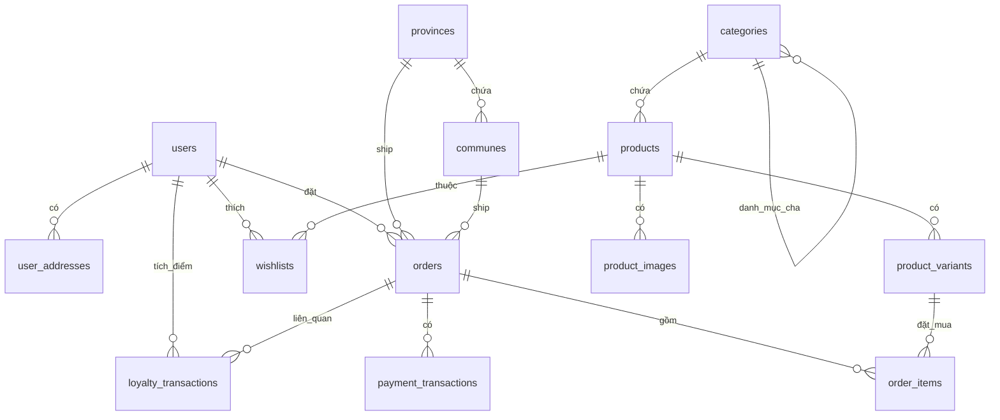

# HƯỚNG DẪN BÀN GIAO & BẢO VỆ ĐỒ ÁN TỐT NGHIỆP
## HỆ THỐNG WEBSITE THƯƠNG MẠI ĐIỆN TỬ THỜI TRANG NAM - NMEN FASHION

---

## 📋 MỤC LỤC
1. [TỔNG QUAN DỰ ÁN & KIẾN TRÚC HỆ THỐNG](#1-tổng-quan-dự-án--kiến-trúc-hệ-thống)
2. [THIẾT KẾ CƠ SỞ DỮ LIỆU (DATABASE SCHEMA & ERD)](#2-thiết-kế-cơ-sở-dữ-liệu-database-schema--erd)
3. [CÁC LUỒNG NGHIỆP VỤ & ĐIỂM SÁNG CÔNG NGHỆ](#3-các-luồng-nghiệp-vụ--điểm-sáng-công-nghệ)
   - 3.1. [Tích Hợp Thanh Toán Tự Động Sepay (Bank Webhook)](#31-tích-hợp-thanh-toán-tự-động-sepay-bank-webhook)
   - 3.2. [Luồng Đặt Hàng & Quản Lý Kho (Transaction & Stock Safety)](#32-luồng-đặt-hàng--quản-lý-kho-transaction--stock-safety)
   - 3.3. [Hệ Thống Phân Hạng Khách Hàng & Điểm Thành Viên (Loyalty)](#33-hệ-thống-phân-hạng-khách-hàng--điểm-thành-viên-loyalty)
   - 3.4. [Hệ Thống Mã Giảm Giá & Validate Giao Dịch](#34-hệ-thống-mã-giảm-giá--validate-giao-dịch)
4. [CƠ CHẾ XÁC THỰC & BẢO MẬT HỆ THỐNG](#4-cơ-chế-xác-thực--bảo-mật-hệ-thống)
5. [CẤU TRÚC CODE & TIẾP CẬN CÔNG NGHỆ](#5-cấu-trúc-code--tiếp-cận-công-nghệ)
6. [HƯỚNG DẪN CÀI ĐẶT & CHẠY DEMO](#6-hướng-dẫn-cài-đặt--chạy-demo)
7. [BỘ CÂU HỎI PHẢN BIỆN THƯỜNG GẶP CỦA HỘI ĐỒNG (FAQ)](#7-bộ-câu-hỏi-phản-biện-thường-gặp-của-hội-đồng-faq)

---

## 1. TỔNG QUAN DỰ ÁN & KIẾN TRÚC HỆ THỐNG

### 1.1. Đề tài Đồ án Gợi ý
* **Tên đề tài**: *"Thiết kế và xây dựng Website Thương mại Điện tử Thời trang Nam tích hợp Hệ thống Thanh toán Tự động và Quản lý Điểm thành viên"*
* **Mục tiêu**: Giải quyết bài toán mua sắm trực tuyến cho nam giới với trải nghiệm mượt mà, hỗ trợ quản lý kho hàng phức tạp (biến thể size/color), tối ưu hóa trải nghiệm khách hàng thân thiết thông qua hệ thống Loyalty Points và tự động hóa quy trình thanh toán chuyển khoản qua ngân hàng.

### 1.2. Công nghệ Sử dụng (Tech Stack)
* **Frontend**: 
  * **Next.js 16 (App Router)**: Tận dụng cơ chế routing theo thư mục, tối ưu hóa SEO (Metadata động), tối ưu hóa hiệu năng tải trang thông qua Server Component kết hợp Client Component.
  * **React 19 & Context API**: Quản lý State toàn cục cho Giỏ hàng ([CartContext.jsx](file:///home/anlqn/nmen/src/context/CartContext.jsx)), Xác thực người dùng ([AuthContext.jsx](file:///home/anlqn/nmen/src/context/AuthContext.jsx)), và Danh sách yêu thích ([WishlistContext.jsx](file:///home/anlqn/nmen/src/context/WishlistContext.jsx)).
  * **Tailwind CSS v4**: Xây dựng giao diện Responsive, hiện đại, tối giản theo phong cách High-end Fashion Store.
* **Backend**:
  * **Node.js & Express.js**: Thiết kế theo mô hình **RESTful API**, kiến trúc tách biệt hoàn toàn với Frontend (Decoupled Architecture). Sử dụng Express giúp hệ thống nhẹ, xử lý bất đồng bộ tốt nhờ cơ chế Event Loop của Node.js.
* **Database**:
  * **MySQL/MariaDB**: Hệ quản trị cơ sở dữ liệu quan hệ bảo đảm tính toàn vẹn dữ liệu cực kỳ cao (ACID transactions), phù hợp cho các luồng thanh toán và quản lý tồn kho.

### 1.3. Mô hình Kiến trúc hệ thống
Hệ thống hoạt động theo mô hình **Client-Server** thông qua giao thức HTTP/HTTPS với dữ liệu trao đổi dạng JSON:

```
[ Trình duyệt / Client ] 
        │  (Next.js App)
        │
        ▼  Requests (HTTP/JSON + JWT Token)
[ Express API Server ] ─── (Xác thực JWT / Phân quyền)
        │
        ├──────► [ Cổng Sepay Webhook ] (Nhận thông báo chuyển khoản ngân hàng)
        │
        ▼  Query / Transaction (mysql2/promise)
[ MySQL Database ]
```

---

## 2. THIẾT KẾ CƠ SỞ DỮ LIỆU (DATABASE SCHEMA & ERD)

Cơ sở dữ liệu của dự án được chuẩn hóa cao để lưu trữ thông tin sản phẩm đa biến thể, quy trình đặt hàng chi tiết và hệ thống điểm tích lũy. Schema được lưu trữ tại file [nmen.sql](file:///home/anlqn/nmen/nmen.sql).

### 2.1. Sơ đồ Quan hệ Thực thể (ERD)
Dưới đây là sơ đồ mối quan hệ giữa các bảng chính trong cơ sở dữ liệu:



### 2.2. Chi tiết các Bảng Quan trọng
1. **`users`**: Lưu thông tin khách hàng và tài khoản quản trị. Chứa thông tin xếp hạng thành viên (`tier`: Hạng Đồng, Bạc, Vàng, Đen) và tổng số điểm hiện có (`points`).
2. **`categories`**: Hỗ trợ danh mục đệ quy qua trường `parent_id` tự liên kết (Self-referencing), giúp tạo cấu trúc menu đa cấp (ví dụ: Áo -> Áo khoác, Áo sơ mi).
3. **`products`**: Thông tin chung của sản phẩm (tên, slug, giá bán lẻ, giá khuyến mãi `sale_price`, mô tả).
4. **`product_variants`**: **Điểm sáng đồ án**. Thay vì bán sản phẩm chung chung, bảng này chia nhỏ sản phẩm theo Phân loại gồm `color_hex`, `color_name`, `size` và số lượng tồn kho `stock` cụ thể cho biến thể đó.
5. **`orders` & `order_items`**: Lưu trữ đơn hàng và chi tiết sản phẩm tại thời điểm mua (lưu cả giá lúc mua phòng trường hợp sau này sản phẩm đổi giá).
6. **`payment_transactions`**: Ghi nhật ký các giao dịch thanh toán từ cổng Webhook hoặc tạo phiên thanh toán chờ.
7. **`loyalty_transactions`**: Lưu lịch sử cộng/trừ điểm (`type`: earn, redeem, adjust) của khách hàng để đảm bảo tính minh bạch.
8. **`provinces` & `communes`**: Dữ liệu địa lý Việt Nam dùng cho tính năng chọn địa chỉ giao hàng chuẩn hóa.

---

## 3. CÁC LUỒNG NGHIỆP VỤ & ĐIỂM SÁNG CÔNG NGHỆ

### 3.1. Tích Hợp Thanh Toán Tự Động Sepay (Bank Webhook)
Đây là tính năng thực tiễn cao nhất trong hệ thống, mô phỏng quy trình thanh toán tự động của các doanh nghiệp lớn.

#### Luồng hoạt động của Webhook (được cấu trúc tại [sepayController.js](file:///home/anlqn/nmen/server/src/controllers/sepayController.js)):
1. Khi khách hàng đặt hàng bằng phương thức **Sepay (Chuyển khoản ngân hàng)**, hệ thống tạo một đơn hàng ở trạng thái `pending` và ghi nhận một transaction trạng thái `pending` trong bảng `payment_transactions` với nội dung chuyển khoản định sẵn chứa mã đơn hàng (ví dụ: `NM-65958`).
2. Khách hàng thực hiện quét mã VietQR và chuyển khoản.
3. Khi tài khoản ngân hàng của cửa hàng nhận được tiền, hệ thống **Sepay** sẽ tự động gửi một tín hiệu **POST request (Webhook)** đến đường dẫn API: `http://tên-miền/api/sepay/webhook`.
4. **Xử lý tại Backend (`sepayController.handleWebhook`)**:
   * **Bước 1 (Xác thực Webhook)**: Kiểm tra mã Authorization Token (`Authorization: Bearer <SEPAY_WEBHOOK_SECRET>`) để đảm bảo request thực sự đến từ Sepay chứ không phải giả mạo.
   * **Bước 2 (Idempotency - Chống trùng lặp)**: Đối chiếu `referenceNumber` (mã tham chiếu giao dịch của ngân hàng) trong bảng `payment_transactions`. Nếu mã giao dịch này đã tồn tại trong DB, hệ thống lập tức dừng và trả về `200 OK` để tránh việc xử lý đơn hàng 2 lần (double-processing).
   * **Bước 3 (Khớp mã đơn hàng)**: Dùng biểu thức chính quy (Regex) `/(NM-\d+)/i` để bóc tách mã đơn hàng nằm trong nội dung tin nhắn chuyển khoản (`transactionContent`).
   * **Bước 4 (Khớp số tiền và trạng thái)**: Tìm đơn hàng trong cơ sở dữ liệu. Nếu số tiền chuyển đến ngân hàng (`amountIn`) lớn hơn hoặc bằng tổng số tiền đơn hàng (`total_amount`), và đơn hàng đó vẫn đang ở trạng thái `pending`, hệ thống sẽ:
     * Cập nhật trạng thái đơn hàng thành `confirmed` (Đã xác nhận).
     * Cập nhật trạng thái thanh toán đơn hàng thành `paid` (Đã thanh toán).
     * Cập nhật trạng thái transaction trong cơ sở dữ liệu thành `success`.
   * **Bước 5 (Phản hồi)**: Trả về HTTP Status `200` để báo cho phía cổng thanh toán biết hệ thống đã nhận và xử lý thành công.

* **Giải pháp chạy thử nghiệm trên máy local (Mock Frontend verify)**: Vì môi trường local (localhost) không thể nhận trực tiếp Webhook từ internet (trừ khi dùng ngrok), dự án đã thiết kế sẵn hàm `verifySepayFrontend` tại file [orderController.js](file:///home/anlqn/nmen/server/src/controllers/orderController.js#L789-L860) giúp sinh viên có thể giả lập luồng thanh toán thành công/thất bại trực tiếp từ giao diện để demo chạy trơn tru trước hội đồng phản biện.

---

### 3.2. Luồng Đặt Hàng & Quản Lý Kho (Transaction & Stock Safety)
Luồng xử lý đặt hàng được xây dựng cực kỳ nghiêm ngặt tại hàm `createOrder` của file [orderController.js](file:///home/anlqn/nmen/server/src/controllers/orderController.js#L36-L304) nhằm tránh các lỗi mất mát dữ liệu hoặc bất đồng nhất thông tin:

* **Không tin tưởng dữ liệu Client gửi lên**: Client chỉ gửi lên ID sản phẩm, ID biến thể và số lượng. Hệ thống tuyệt đối không lấy giá tiền từ client gửi lên (vì hacker có thể sửa đổi request bằng Burp Suite để mua sản phẩm giá 0đ). Backend sẽ tự động truy vấn trực tiếp bảng `products` trong Database để lấy giá gốc (`price`) và giá khuyến mãi (`sale_price`) để tự tính toán tổng tiền.
* **Xử lý tranh chấp kho (Race Condition & Transaction)**:
  * Sử dụng cơ chế Database Transaction (`conn.beginTransaction()`).
  * Thực hiện kiểm tra số lượng tồn kho (`stock`) của từng biến thể trước khi cho phép tạo đơn.
  * Nếu một sản phẩm trong giỏ hàng không đủ số lượng tồn kho, hệ thống thực hiện `conn.rollback()` ngay lập tức để hủy bỏ toàn bộ tiến trình trước đó, báo lỗi chính xác về cho khách hàng.
  * Nếu mọi sản phẩm đủ hàng, hệ thống tiến hành trừ kho (`UPDATE product_variants SET stock = stock - ?`), ghi nhận thông tin đơn hàng, rồi mới thực hiện `conn.commit()`.
* **Hoàn kho tự động**:
  * Khi đơn hàng bị khách hàng hoặc quản trị viên chuyển trạng thái sang `cancelled` (Hủy đơn) hoặc `returned` (Trả hàng) tại hàm `updateOrderStatus` của [orderController.js](file:///home/anlqn/nmen/server/src/controllers/orderController.js#L395-L460), hệ thống sẽ kích hoạt trigger ở backend quét qua toàn bộ sản phẩm trong đơn và thực hiện cộng ngược số lượng sản phẩm vào kho hàng (`UPDATE product_variants SET stock = stock + ?`), giải phóng lượng tồn kho bị giữ chân.

---

### 3.3. Hệ Thống Phân Hạng Khách Hàng & Điểm Thành Viên (Loyalty)
Nhằm tăng tỷ lệ giữ chân khách hàng (Retention Rate), hệ thống tích hợp cơ chế Loyalty Points thông minh:
* **Tích lũy điểm**: Khi khách hàng mua sắm thành công (đơn hàng chuyển sang `delivered`), hệ thống tự động cộng điểm tích lũy vào tài khoản của khách hàng dựa trên phần trăm giá trị đơn hàng (được cấu hình động hoặc mặc định).
* **Phân hạng thành viên**:
  * Khách hàng tự động được phân chia hạng thành viên dựa trên tổng số điểm tích lũy hiện có của họ:
    * **Hạng Đồng**: Khởi điểm (0đ)
    * **Hạng Bạc**: Đạt mốc điểm quy định
    * **Hạng Vàng**: Đạt mốc điểm cao hơn
    * **Hạng Đen (VIP)**: Hạng cao nhất
  * Cấp độ hạng thành viên có thể được sử dụng để áp dụng các chính sách chiết khấu tự động hoặc quyền lợi riêng biệt cho từng nhóm khách hàng.

---

### 3.4. Hệ Thống Mã Giảm Giá & Validate Giao Dịch
Quy trình áp dụng mã giảm giá (`promo_codes`) được kiểm tra chặt chẽ qua nhiều bước bảo mật:
1. **Kiểm tra trạng thái kích hoạt** (`is_active = 1`).
2. **Kiểm tra thời hạn sử dụng** (`expires_at` phải lớn hơn thời gian hiện tại).
3. **Kiểm tra lượt sử dụng** (`used_count` phải nhỏ hơn `max_uses`).
4. **Kiểm tra điều kiện đơn hàng** (Tổng giá trị đơn hàng phải đạt mức chi tiêu tối thiểu `min_order`).
5. **Đảm bảo tính nhất quán**: Việc tăng số lần sử dụng mã giảm giá (`used_count = used_count + 1`) được thực hiện đồng thời trong Database Transaction tạo đơn hàng. Nếu đơn hàng lỗi và bị rollback, mã giảm giá sẽ không bị mất lượt sử dụng.

---

## 4. CƠ CHẾ XÁC THỰC & BẢO MẬT HỆ THỐNG

Dự án áp dụng các tiêu chuẩn bảo mật hiện đại nhằm bảo vệ thông tin người dùng và API endpoints:

### 4.1. Mã Hóa Mật Khẩu (Password Hashing)
* Hệ thống sử dụng thư viện **`bcryptjs`** để mã hóa mật khẩu trước khi lưu vào database.
* Bcrypt sử dụng thuật toán băm chậm (Blowfish cipher) kết hợp tự động sinh muối (Salt) ngẫu nhiên với hệ số phức tạp `10` vòng băm. 
* Cơ chế này chống lại các cuộc tấn công tra cứu bảng băm chuẩn bị sẵn (Rainbow Table Attack) và tấn công vét cạn (Brute-force). Mật khẩu sau khi băm sẽ không thể dịch ngược trở lại thành chuỗi gốc. Quy trình băm này được thực hiện tại hàm `register` và `updatePassword` của [authController.js](file:///home/anlqn/nmen/server/src/controllers/authController.js).

### 4.2. Xác Thực Phiên Làm Việc Stateful vs Stateless (JWT)
* Dự án sử dụng **JSON Web Token (JWT)** cho cơ chế xác thực Stateless.
* Ưu điểm: Máy chủ backend không cần tạo session lưu trữ trong RAM (giúp hệ thống dễ mở rộng quy mô - Horizontal Scaling). Token chứa thông tin định danh được mã hóa và ký tên bởi khóa bí mật phía máy chủ (`JWT_SECRET`).
* Khi người dùng đăng nhập thành công, máy chủ trả về token. Client lưu token này ở `localStorage` và tự động gửi đính kèm lên header `Authorization: Bearer <token>` ở mỗi request tiếp theo thông qua hàm interceptor trong file [api.js](file:///home/anlqn/nmen/src/lib/api.js).

### 4.3. Kiến Trúc Middleware Phân Quyền
Hệ thống kiểm soát quyền truy cập API bằng 3 lớp Middleware tại Backend:
1. **`auth`** (đặt tại [auth.js](file:///home/anlqn/nmen/server/src/middleware/auth.js)): Bắt buộc người dùng phải gửi token JWT hợp lệ. Thực hiện kiểm tra trạng thái tài khoản trong DB (`status = 'active'`). Nếu tài khoản bị đánh dấu `inactive`, request lập tức bị từ chối với mã lỗi `401 Unauthorized`.
2. **`adminOnly`** (đặt tại [adminOnly.js](file:///home/anlqn/nmen/server/src/middleware/adminOnly.js)): Chạy sau middleware `auth`, kiểm tra xem trường `role` trong payload giải mã của token có phải là `admin` hay không. Nếu không, trả về lỗi `403 Forbidden` (Không có quyền truy cập).
3. **`authOptional`** (đặt tại [authOptional.js](file:///home/anlqn/nmen/server/src/middleware/authOptional.js)): Sử dụng cho các màn hình công khai nhưng có hành vi cá nhân hóa (ví dụ: Trang chi tiết sản phẩm, khách vãng lai vẫn xem được, nhưng nếu là user đã đăng nhập thì hệ thống sẽ nhận diện được thông tin của họ để hiển thị nút yêu thích sản phẩm). Middleware này giải mã token nếu có, nhưng không chặn request nếu không gửi token.

### 4.4. Cơ Chế Tài Khoản Quản Trị Bảo Mật
* Mật khẩu và email admin được cấu hình trực tiếp từ file biến môi trường `.env` (`ADMIN_EMAIL`, `ADMIN_PASSWORD`), hoàn toàn tách biệt khỏi cơ sở dữ liệu.
* Điều này ngăn chặn việc hacker khai thác lỗi SQL Injection để chèn tài khoản admin ảo vào database hoặc sửa quyền truy cập trực tiếp từ database.

---

## 5. CẤU TRÚC CODE & TIẾP CẬN CÔNG NGHỆ

### 5.1. Phân Tích Cấu Trúc Mã Nguồn Frontend (Next.js Client)
```
nmen/src/
├── app/
│   ├── (client)/          # Nhóm các trang phía khách hàng (Storefront)
│   │   ├── [slug]/        # Static Pages động (Về chúng tôi, Chính sách...)
│   │   ├── cart/          # Trang giỏ hàng
│   │   ├── checkout/      # Trang thanh toán
│   │   └── page.jsx       # Trang chủ cửa hàng
│   │
│   ├── admin/             # Nhóm các trang quản lý của Admin
│   │   ├── products/      # Quản lý danh sách, thêm, sửa sản phẩm
│   │   ├── orders/        # Quản lý đơn hàng, đổi trạng thái đơn
│   │   └── page.jsx       # Dashboard thống kê doanh thu, đơn hàng
│   │
│   ├── layout.jsx         # Layout gốc thiết lập font chữ và HTML
│   └── globals.css        # Khai báo biến CSS, thiết lập theme màu
│
├── components/            # Các thành phần tái sử dụng (Button, Card, Modal...)
├── context/               # Các Provider quản lý State (Giỏ hàng, Auth, Wishlist)
└── lib/                   # API Fetch Helper, định dạng tiền tệ, cấu hình chung
```

### 5.2. Phân Tích Cấu Trúc Mã Nguồn Backend (Express Server)
```
nmen/server/src/
├── app.js                 # Điểm khởi chạy Express, cấu hình CORS, khai báo Routes
├── db.js                  # Cấu hình Pool kết nối MySQL bằng mysql2/promise
│
├── middleware/            # Chứa các bộ lọc xác thực (auth, adminOnly, authOptional)
│
├── routes/                # Định nghĩa các endpoint RESTful API
│   ├── products.js        # GET /api/products, POST /api/products...
│   ├── orders.js          # POST /api/orders, PATCH /api/orders/:id...
│   └── sepay.js           # Endpoint nhận webhook từ cổng Sepay
│
└── controllers/           # Nơi xử lý logic nghiệp vụ và truy vấn Database
    ├── productController.js
    ├── orderController.js
    └── sepayController.js
```

---

## 6. HƯỚNG DẪN CÀI ĐẶT & CHẠY DEMO

Để chạy thử nghiệm dự án mượt mà trên máy tính cá nhân để chuẩn bị bảo vệ:

### Bước 1: Chuẩn bị Cơ sở dữ liệu
1. Khởi động MySQL/MariaDB Server.
2. Tạo một database mới tên là `nmen`.
3. Import file dữ liệu mẫu [nmen.sql](file:///home/anlqn/nmen/nmen.sql) nằm ở thư mục gốc vào database vừa tạo bằng câu lệnh command line hoặc qua giao diện phần mềm (MySQL Workbench, DBeaver, phpMyAdmin):
   ```bash
   mysql -u root -p nmen < nmen.sql
   ```

### Bước 2: Cấu hình biến môi trường
1. Tại thư mục **`server`**, tạo file **`.env`** (dựa trên [server/.env.example](file:///home/anlqn/nmen/server/.env.example)):
   * Chỉnh sửa các thông số kết nối Database: `DB_HOST`, `DB_USER`, `DB_PASSWORD`, `DB_NAME`.
   * Kiểm tra thông tin tài khoản Admin mặc định hoặc chỉnh sửa tùy ý.
2. Tại thư mục **gốc** của dự án, tạo file **`.env.local`**:
   * Thiết lập đường dẫn API URL: `NEXT_PUBLIC_API_URL=http://localhost:5000`

### Bước 3: Cài đặt và khởi chạy dự án
Mở terminal tại thư mục gốc và thực hiện các lệnh sau:
```bash
# 1. Cài đặt các thư viện cần thiết cho cả Client và Server
npm run setup # Hoặc chạy thủ công: npm install && cd server && npm install && cd ..

# 2. Khởi chạy đồng thời cả Client và Server trong chế độ phát triển
npm run dev:all
```

* Truy cập Website khách hàng: `http://localhost:3000`
* Truy cập Trang quản trị Admin: `http://localhost:3000/admin` (Đăng nhập: `admin@nmen.vn` / `123456`)

---

## 7. BỘ CÂU HỎI PHẢN BIỆN THƯỜNG GẶP CỦA HỘI ĐỒNG (FAQ)

Khi bảo vệ đồ án tốt nghiệp, Hội đồng đánh giá thường tập trung hỏi sâu về tính logic, bảo mật và kỹ thuật giải quyết bài toán. Dưới đây là các câu hỏi phổ biến nhất và gợi ý câu trả lời ngắn gọn, chuẩn kỹ thuật:

#### Câu 1: Em hãy giải thích quy trình xử lý thanh toán tự động qua chuyển khoản ngân hàng (Sepay Webhook) hoạt động như thế nào trong hệ thống của em?
* **Trả lời**: Quy trình gồm 4 bước chính (xem mã nguồn tại [sepayController.js](file:///home/anlqn/nmen/server/src/controllers/sepayController.js)):
  1. Khi người dùng tạo đơn hàng bằng phương thức chuyển khoản, backend ghi nhận đơn hàng ở trạng thái `pending` và ghi nhận một transaction chờ thanh toán có nội dung chuyển khoản chứa mã đơn hàng (ví dụ: `NM-12345`).
  2. Khi khách hàng chuyển khoản thành công, hệ thống Sepay ghi nhận giao dịch tại ngân hàng và gửi một webhook (POST request) chứa thông tin giao dịch đến endpoint `/api/sepay/webhook` trên server của em.
  3. Server xác thực request này bằng token bí mật (`Authorization Bearer`). Sau đó, server dùng regex `/(NM-\d+)/i` để trích xuất mã đơn hàng từ nội dung chuyển khoản, kiểm tra xem giao dịch đã xử lý chưa (tránh trùng lặp nhờ `reference_number`), khớp số tiền chuyển khoản với tổng số tiền của đơn hàng.
  4. Nếu mọi thông tin khớp, đơn hàng được cập nhật trạng thái thành `confirmed` và `paid`.

#### Câu 2: Làm sao để em chống được việc người dùng cố tình thay đổi giá tiền của sản phẩm từ phía Client để mua sản phẩm đắt tiền với giá 0đ khi tạo yêu cầu Checkout?
* **Trả lời**: Hệ thống của em áp dụng nguyên tắc **"Không tin tưởng dữ liệu từ Client"**. Khi gửi yêu cầu đặt hàng, client chỉ gửi lên ID sản phẩm, ID biến thể và số lượng mua. Backend tại file [orderController.js](file:///home/anlqn/nmen/server/src/controllers/orderController.js#L71-L114) sẽ tự động thực hiện truy vấn (Query) trực tiếp vào bảng `products` trong Database để lấy giá bán thực tế (`price` hoặc `sale_price`), sau đó tự tính toán tổng số tiền của đơn hàng ở phía máy chủ trước khi thực hiện thanh toán và ghi nhận đơn hàng. Do đó, việc can thiệp sửa đổi giá ở phía client là hoàn toàn vô dụng.

#### Câu 3: Làm thế nào hệ thống của em đảm bảo số lượng tồn kho (stock) chính xác khi có nhiều người cùng thanh toán một sản phẩm tại cùng một thời điểm (Race Condition)?
* **Trả lời**: Em sử dụng cơ chế **Database Transaction** (`conn.beginTransaction()`) tại file [orderController.js](file:///home/anlqn/nmen/server/src/controllers/orderController.js#L154-L232). Khi xử lý đơn hàng, backend truy vấn số lượng tồn kho hiện tại của biến thể sản phẩm trực tiếp từ DB. Nếu số lượng tồn kho nhỏ hơn số lượng khách đặt, giao dịch sẽ lập tức bị hủy bỏ (`conn.rollback()`) và báo lỗi cho khách hàng. Nếu đủ hàng, hệ thống tiến hành trừ kho và tạo đơn, sau cùng mới commit (`conn.commit()`). Quá trình này giúp khóa bản ghi và đảm bảo tính nhất quán dữ liệu tại thời điểm xử lý.

#### Câu 4: Tại sao em lại cấu hình tài khoản Admin trực tiếp từ file biến môi trường `.env` thay vì lưu trong Database giống như người dùng thông thường?
* **Trả lời**: Việc thiết lập tài khoản Admin cứng trong file cấu hình hệ thống (xem chi tiết tại [authController.js](file:///home/anlqn/nmen/server/src/controllers/authController.js#L5-L12)) là một giải pháp bảo mật tốt cho các hệ thống quy mô nhỏ đến vừa:
  1. Nó tránh hoàn toàn rủi ro hacker khai thác các lỗ hổng như SQL Injection để chèn tài khoản admin mới hoặc cập nhật quyền admin (`role = admin`) cho các tài khoản thông thường trong Database.
  2. Việc không lưu mật khẩu quản trị cao cấp nhất trong DB giúp giảm thiểu nguy cơ lộ lọt thông tin khi database bị tấn công hoặc xuất file sao lưu (dump SQL).

#### Câu 5: Em hãy giải thích cơ chế phân hạng khách hàng (Tiering) và điểm tích lũy (Loyalty) được tính toán và lưu trữ ra sao?
* **Trả lời**: Hệ thống sử dụng hai bảng `users` và `loyalty_transactions`. 
  * Khi đơn hàng chuyển sang trạng thái thành công (`delivered`), backend sẽ tạo một giao dịch cộng điểm trong `loyalty_transactions` và cộng trực tiếp số điểm này vào cột `points` của người dùng trong bảng `users`.
  * Hạng thành viên (`tier` dạng Enum: Đồng, Bạc, Vàng, Đen) được tính toán tự động hoặc cập nhật dựa trên tổng số điểm tích lũy hiện có của khách hàng. Lịch sử điểm được ghi nhận chi tiết giúp khách hàng dễ dàng theo dõi và đối soát.

#### Câu 6: Làm thế nào hệ thống bảo mật thông tin mật khẩu của người dùng?
* **Trả lời**: Mật khẩu của người dùng khi đăng ký sẽ được băm bằng thuật toán **Bcrypt** thông qua thư viện `bcryptjs` với hệ số phức tạp là 10 vòng băm trước khi lưu vào Database. Thuật toán này tự động thêm chuỗi muối (Salt) ngẫu nhiên, giúp mật khẩu đã băm không thể bị dịch ngược và chống lại các kiểu tấn công từ điển hay tấn công bảng băm chuẩn bị sẵn.

#### Câu 7: Cơ chế phân quyền (Authorization) của ứng dụng hoạt động như thế nào?
* **Trả lời**: Hệ thống sử dụng xác thực stateless bằng **JWT (JSON Web Token)**. Khi người dùng đăng nhập thành công, server cấp một token chứa thông tin payload gồm `id`, `email`, và `role`. 
  * Ở phía client, token được lưu vào `localStorage` và gửi kèm trong Header `Authorization` ở mỗi request.
  * Phía backend sử dụng 3 lớp middleware: [auth.js](file:///home/anlqn/nmen/server/src/middleware/auth.js) kiểm tra tính hợp lệ của token và trạng thái tài khoản; [adminOnly.js](file:///home/anlqn/nmen/server/src/middleware/adminOnly.js) kiểm tra xem quyền có phải admin hay không; [authOptional.js](file:///home/anlqn/nmen/server/src/middleware/authOptional.js) chỉ giải mã thông tin người dùng nếu có token để hiển thị giao diện cá nhân hóa nhưng không bắt buộc đăng nhập để xem thông tin chung.

#### Câu 8: Tại sao em chọn Next.js (App Router) cho phần Frontend thay vì React SPA (Single Page Application) truyền thống?
* **Trả lời**: Next.js mang lại nhiều lợi thế vượt trội cho một website thương mại điện tử:
  1. **SEO tốt hơn**: Nhờ cơ chế Server-side Rendering (SSR) và Metadata động, các công cụ tìm kiếm dễ dàng cào dữ liệu sản phẩm, giúp trang web có thứ hạng tốt trên Google.
  2. **Hiệu năng cao**: Tự động tối ưu hóa hình ảnh, tách nhỏ code (Code Splitting) và hỗ trợ Server Components giúp giảm tải dung lượng JavaScript tải về trình duyệt, tăng tốc độ phản hồi trang web.
  3. **Cấu trúc rõ ràng**: App Router giúp quản lý định tuyến (routing) trực quan theo thư mục và dễ dàng tổ chức các layout lồng nhau giữa khu vực khách hàng (`(client)`) và khu vực quản lý (`admin`).

---
> [!TIP]
> **Lời khuyên khi bảo vệ đồ án:** Hãy bình tĩnh, trình bày rõ ràng các luồng hoạt động chính, nhấn mạnh vào các tính năng nổi bật như **Thanh toán tự động Sepay**, **Quản lý tồn kho an toàn bằng Transaction** và **Bảo mật phân quyền bằng JWT Middleware**. Những chi tiết kỹ thuật này là điểm cộng rất lớn giúp em đạt điểm xuất sắc từ hội đồng. Chúc em bảo vệ đồ án thành công rực rỡ!
